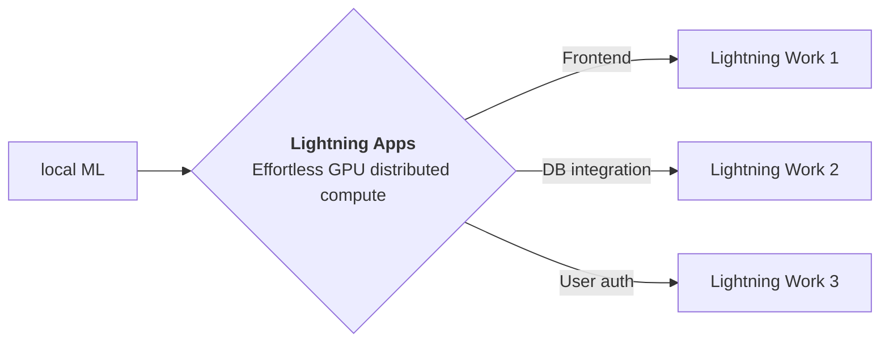

<div style="height: 90pt;"></div>
<div style="flex: 0 0 16%; margin-top: -10pt;">

</div>
<div style="flex: 0 0 65%; text-align: center;">
<h1 style="margin-bottom: 10pt;">OFA: Unifying Architectures, Tasks, and Modalities Through a Simple Sequence-to-Sequence Learning Framework</h1>
<h2>A demo of OFA [ICML22] research paper using Lightning App</h2>
</div>
<div style="flex: 1">
    <div style="display: flex; align-items: center;">
        
        <div style="font-size: 0.9rem; margin-right: 5pt;"><a href="https://github.com/lightning-ai/">Lightning-AI</a></div>
    </div>
    <div style="display: flex; align-items: center;">
        
        <div style="font-size: 0.9rem;"><a href="https://twitter.com/pytorchlightnin">@PytorchLightnin</a></div>
    </div>
</div>

--split--

# Unifying Architectures, Tasks, and Modalities Through a Simple Sequence-to-Sequence Learning Framework

OFA is a unified multimodal pretrained model that unifies modalities (i.e., cross-modality, vision, language) and
tasks (e.g., image generation, visual grounding, image captioning, image classification, text generation, etc.) to a
simple sequence-to-sequence learning framework. For more information, please refer to the paper: OFA: Unifying
Architectures, Tasks, and Modalities Through a Simple Sequence-to-Sequence Learning Framework.


--split--

# Lightning Apps

## Lightning Apps can be built for any AI use case, including AI research, fault-tolerant production-ready pipelines, and everything in between.

!!! abstract "Key Features"

    - **Easy to use-** Lightning apps follow the Lightning philosophy- easy to read, modular, intuitive, pythonic and highly composable interface that allows you to focus on what's important for you, and automate the rest.
    - **Easy to scale**- Lightning provides a common experience locally and in the cloud. The Lightning.ai cloud platform abstracts the infrastructure, so you can run your apps at any scale. The modular and composable framework allows for simpler testing and debugging.
    - **Leverage the power of the community-** Lightning.ai offers a variety of apps for any use case you can use as is or build upon. By following the best MLOps practices provided through the apps and documentation you can deploy state-of-the-art ML applications in days, not months.



### Available at : `Lightning-AI/lightning-template-research-app/app.py`

```python
import lightning as L

poster_dir = "resources"
paper = "https://arxiv.org/abs/2202.03052"
github = "https://github.com/OFA-Sys/OFA"
notebook_path = "resources/OFA.ipynb"
tabs = ["Poster", "model demo", "Notebook viewer", "Paper"]

app = L.LightningApp(
    ResearchApp(
        paper=paper,
        poster_dir=poster_dir,
        notebook_path=notebook_path,
        launch_gradio=True,
        launch_jupyter_lab=False,  # don't launch for public app, can expose to security vulnerability
    )
)

```

### Citation

```bibtex

@article{YourName,
  title={Your Title},
  author={Your team},
  journal={Location},
  year={Year}
}

```
